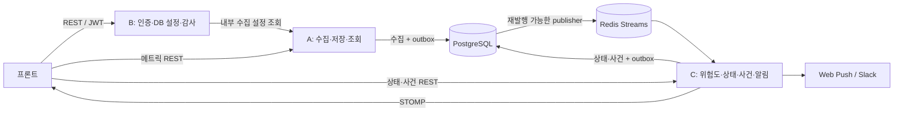

# 팀 통신·연동 규격 초안 v0.2

상태: **팀 배포용 개발 기준 초안**. 사용자의 위임에 따라 설계 선택과 기본값을 이 문서 묶음에서 정했다. 각 담당자는 아래 규격을 목표로 구현한다. 초안 작성은 애플리케이션 구현·배포 완료를 의미하지 않는다.

기준 코드: `d2f65db2707a6d433c45a22e3bcf003988238727` / 작성일: 2026-09-28 / 브랜치: `feature/docs-integration-contracts`.

## 문서 사용 순서

| 문서 | 포함 내용 | 읽을 사람 |
| --- | --- | --- |
| 이 문서 | 전체 구조, 결정 사항, 기본값, 현재 코드와 차이 | 전원 |
| [REST 규격](api.md) | 모든 MVP API, 필드·권한·오류·조회 규칙 | A·B·C·프론트 |
| [이벤트·실시간 규격](events.md) | 지표, Redis DTO·ACK·복구, STOMP 메시지·재연결 | A·C·프론트 |
| [인증·보안 규격](integration-security.md) | JWT·Refresh·CSRF·암호화·네트워크 접근 | B 주관, A·C·프론트 |
| [저장·운영 규격](integration-operations.md) | 테이블 소유권·내부 서비스·환경·보관·복구 | A·B·C |
| [담당별 적용·검수표](integration-handoff.md) | 적용 순서·수정 목록·요구사항별 검수 | 전원 |

문서의 **현재 코드**는 조사 사실이고, 나머지 **v1 개발 기준**은 구현할 목표다. 이전 문서의 ‘추가 합의’ 항목은 이 묶음의 결정으로 대체한다. 실제 서버 주소·키·계정은 배포 입력값이며 설계 미결정 사항이 아니다. 규격을 바꾸려면 생산자와 소비자 변경을 같은 PR에 명시한다.

## 1. MVP 아키텍처와 범위

- 백엔드는 단일 Spring Boot 애플리케이션, 실행 인스턴스는 1개다. A/B/C는 코드 소유 구분이며 별도 마이크로서비스가 아니다.
- 시스템 저장소는 PostgreSQL, 내부 전달은 Redis Streams, 수집 대상은 MariaDB다.
- 프론트는 REST + native WebSocket/STOMP 1.2를 사용한다. SockJS와 별도 STOMP 브로커는 사용하지 않고 Spring simple broker를 사용한다.
- API·프론트·소켓은 운영에서 같은 HTTPS origin으로 제공한다. 프론트 프레임워크와 무관하게 이 통신 계약을 지킨다.
- 위험도·장애 상태의 소유자는 C다. A의 기존 위험도 코드는 C가 재사용하되 A 스케줄러의 직접 판단·사건 발행·자동 차단 호출은 제거한다.
- 장애 중에도 수집을 계속한다. 자동 수집 차단과 기존 projects block/unblock/toggle API는 v1에서 제외한다. 수동 중단·재개는 DB 설정의 enabled 변경으로 통일한다.
- 메신저는 Slack Incoming Webhook, 개인 알림은 표준 Web Push로 정한다. 사용자 계정은 공용 프로젝트에 속하고 USER도 모든 대상 DB를 조회한다.
- AI 보고서, 쿼리 원문 분석, 멀티테넌트, 다중 인스턴스, 임의 SQL 실행, 서버 접근 차단, 이메일 인증/비밀번호 재설정은 이번 MVP 범위에서 제외한다.

## 2. 공통 규칙

| 항목 | 개발 기준 |
| --- | --- |
| API | `/api/v1`, UTF-8 JSON, 성공 DTO 직접 반환, 페이지 응답만 items 래퍼 |
| 명명 | 필드 camelCase, enum UPPER_SNAKE_CASE, DB 테이블/컬럼 snake_case |
| 식별 | 외부 ID는 1~9007199254740991 JSON 정수, UUID eventId/incidentId는 소문자 문자열 |
| 대상 ID | DB 자원 자체는 id, 다른 DTO가 참조할 때는 databaseConfigId; 별도 projectId를 만들지 않음 |
| DB 이름 | 설정 name=표시명, 설정 databaseName=실제 스키마; 기존 이벤트의 databaseName은 표시명으로 유지 |
| 시간 | UTC ISO 문자열 `YYYY-MM-DDTHH:mm:ss.SSSZ`; 저장 timestamptz, Java Instant. 날짜 배열·시간대 없는 문자열 금지 |
| nullable | 응답의 정의된 필드는 모두 포함; 불명 값 null, 빈 목록 []; 실제 측정 0과 실패 null 구분 |
| 요청 | 알려지지 않은 필드·enum·중복 JSON 키는 400. PATCH 생략은 유지; null은 nullable 필드에서만 허용 |
| 응답 확장 | 클라이언트는 모르는 응답 필드를 무시. 새로운 enum/의미/필수 필드 변경은 새 계약 버전 |
| 오류 | code/message/requestId/fieldErrors 공통 DTO. 401/403/404/409/429/500/503 구분 |
| 추적 | 서버 UUID requestId와 X-Request-Id. 이벤트 eventId는 전송 재시도에도 동일 |
| 비밀 | 비밀번호·토큰·암호문·Push 비밀·Webhook URL을 공개 DTO/이벤트/로그에 포함하지 않음 |
| 단위 | 시간 간격 필드 Seconds 또는 Ms 명시; CPU 백분율 0~100, 연결 비율 0.8=80%, 용량 byte |

## 3. 기본 정책값

아래는 팀의 초기 개발·검수 기준값이다. 운영자가 바꿀 수 있는 값은 지정 API 또는 환경 변수만 사용한다.

| 항목 | 값 | 소유 |
| --- | --- | --- |
| 수집 | 5초, 대상별 중첩 금지, 동시 최대 10개, MVP 대상 최대 20개 | A |
| 접속/쿼리/전체 작업 제한 | 각각 5초 / 5초 / 15초 | A |
| 메트릭 보관/정리 | 30일 / 매일 UTC 03:00 | A |
| 사건·감사·차단 과거 이력 | 180일 / 매일 UTC 03:10 | C·B |
| 접속 로그 | 30일, GET 성공은 access_logs에만 기록 | B |
| 위험 단계 | INFO, WARNING, CRITICAL, FATAL; 판단 불가 null | C |
| 연결 비율 경보 | WARNING 0.80, CRITICAL 0.90, FATAL 0.95; 15초 지속 | C |
| Slow Query 경보 | 증가량/실제 초 = slowQueriesPerSecond; WARNING 1.0, CRITICAL 5.0, FATAL 미사용; 15초 지속 | C |
| 정상 복구 | 모든 해당 규칙의 경고 기준 아래에서 15초 연속 성공 | C |
| 접속 실패 사건 | 15초 연속 실패 후 FATAL; 15초 성공 후 복구 | C |
| 미수집 사건 | 마지막 시도 시작/활성화 후 30초 경과 시 CRITICAL; 새 유효 수집이 15초 지속되면 복구 | C |
| Heartbeat | 수집 루프와 별도 10초, 늦음 기준 30초 | A·C |
| Access / Refresh | JWT 15분 / opaque token 7일 절대 만료, 회전 | B |
| 인증 키·비밀번호 | HS256 32바이트 이상 키 / Argon2id, 보안 문서의 파라미터 | B |
| 내부 Redis 복구 창 | 최소 24시간, pending 보호; outbox 미발행은 삭제 금지 | A·C |
| 중복 처리 기록 | 31일; 30일보다 오래된 메트릭의 자동 재처리 거부 | A·C |
| 알림 | OPEN 즉시, 상승은 300초 안에서 병합(FATAL 즉시), 복구 즉시, 정기 재알림 없음 | C |
| 외부 발송 재시도 | 첫 시도 + 5/30/120초 후 3회; 429는 Retry-After 존중 | C |
| 프론트 상태 대조 | 구독 직후·2초 후·이후 30초마다 REST 최신값 대조 | 프론트 |
| 페이지 | page 0, size 20, 최대 100; 메트릭 recent 50/최대 1000 | 전원 |

CPU/메모리는 실제 수집원이 없으므로 값 null·UNSUPPORTED, 정책 평가 제외다. QPS는 관측만 제공하고 기본 경보 규칙은 두지 않는다. DB별 수집 주기는 5초 고정이므로 설정 입력을 노출하지 않는다.

## 4. 현재 코드에서 바꿀 계약

| 항목 | 현재 | v1 목표 | 담당 |
| --- | --- | --- | --- |
| 위험도 | 수집 스케줄러 직접 호출 | C 소비자가 한 번만 판단·영속 저장 | A·C |
| 자동 차단 | FATAL이면 enabled=false | 자동 차단 제거, 수집 지속 | A |
| 수동 중단 | projects block/unblock/toggle | PATCH databases/{id}, enabled+configVersion | B·프론트 |
| Ping | GET /api/databases/{id}/ping, 상태 변경 | POST /api/v1/databases/{id}/ping, 진단 결과만 반환 | A |
| latest 빈 데이터 | 대상 없음과 지표 없음 모두 404 | 대상 없음 404, 아직 관측 없음 204 | A·프론트 |
| history 기간 | 양 끝 포함 | start 포함/end 제외 | A·프론트 |
| 시간 | LocalDateTime, 포맷 미통일 | UTC Instant·문자열, 과거 값은 기존 시간대 확인 후 변환 | 전원 |
| QPS 초기값 | 첫 관측/카운터 초기화 0 | null + WARMUP/COUNTER_RESET | A |
| Slow Query | 누적값으로 판단 | 누적값 유지 + 구간 증가량·초당 비율로 판단 | A·C |
| 인증·암호화 | 공통 인증 없음, DB password 직접 사용 | B 보안 서비스·암호화 경계 | B·A·C |
| 발행 실패 | 로그 후 유실 가능 | 저장+outbox, UUID eventId 재사용 | A·C |
| 사건 | 매 평가 새 UUID | OPEN 1건 유지, RESOLVED·종료 사유·버전 저장 | C |
| OpenAPI | 기본 어노테이션 | v1 요청/응답·권한·오류·예제 전체 명시 | 각 소유자 |

위 경로/필드/동작 변경은 같은 통합 릴리스에서 적용한다. 구버전 API를 동시에 운영하는 호환 계층은 만들지 않는다. 전환 전 데이터 보존 절차는 [운영 규격](integration-operations.md)을 따른다.

## 5. 담당 경계

| 담당 | 구현 범위 | 제공 산출물 |
| --- | --- | --- |
| A | 공통 실행 환경·마이그레이션 조정, MariaDB 수집·조회, outbox 기반 발행 공통 기반 | CollectorTarget 소비, Metric DTO, 메트릭 API, 공통 outbox 저장/publisher |
| B | 사용자·토큰·RBAC, DB 설정 CRUD·암호화, 보안/예외/OpenAPI 공통 설정, 감사 | AuthPrincipal/TargetProvider/AuditRecorder, 인증·관리 API |
| C | 정책·위험도·상태·사건, Redis 소비, STOMP, Push/Slack·수신처 | 상태/사건/정책 API, 이벤트 소비·발행, 알림 |
| 프론트 로그인 담당 | 로그인/가입/갱신, 역할별 화면 접근, 공통 HTTP 오류 | Access 메모리 보관·Refresh single-flight·CSRF 처리 |
| 프론트 대시보드 담당 | 대상 관리·차트·상태·정책·사건/감사 화면·알림 구독 | REST/STOMP 통합·순서/중복 처리·Push 서비스 워커 |

담당 순서·변경 파일·수치 검수는 [적용·검수표](integration-handoff.md)에 있다. 문서만 작성한 이번 단계에서는 완료 체크를 하지 않는다.

## 6. 기준 코드 진행 현황

아래는 v0.2 목표와 별개로 기준 커밋에서 확인한 현황이다.

원격 조회 후 최신 `develop`을 로컬에 fast-forward로 반영했다. `feature/be-collector`의 `c40e7de`까지 PR #1로 합쳐진 상태다. 원격 `feature/be-auth`, `feature/be-notification`, 프론트 두 브랜치는 조회 시점에 `0e98159`의 초기 문서 상태였다. 개인 PC·다른 저장소·미업로드 작업은 확인 범위에 포함하지 않는다.

| 영역 | 현재 코드에서 확인한 것 | 아직 구현·연동 확인이 필요한 것 |
| --- | --- | --- |
| 공통 기반 | Java 17 대상, Spring Boot 3.2.3, Gradle 8.5, PostgreSQL/JPA, Redis, springdoc 의존성 | 공통 인증·오류 처리, DB 마이그레이션, 통합 실행 환경 |
| A: DB 수집 | MariaDB Ping·버전 조회, 주기적 수집, 성공/실패 구분, PostgreSQL 저장 | 고정 5초 수집·대상별 중첩 방지 적용, 마지막 성공 시각, 실패 유형 세분화, 암호화 접속 정보 연결 |
| A: 메트릭 조회 | 최신·최근 N개·기간 조회 API, 30일 보관 및 정리 스케줄 | 인증, 조회 범위 제한, 공통 오류, 시간대 계약 |
| 내부 발행 | `stream:metrics`, `stream:incidents`에 `payload` JSON 발행 | 소비자, ACK·재시도·중복 처리, 저장과 발행 사이 유실 복구 |
| 위험도·차단 | 수집기에서 위험도 판단, 사건 이벤트 생성, FATAL이면 수집 중단, 수동 차단/해제 | C 담당 경계 적용, 지속 시간, 사건 저장·복구·중복 억제, 차단과 장애 상태 분리 |
| B: 인증·DB 관리 | `DatabaseConfig` 엔티티, 접속 로그 저장 기반 | 회원가입·JWT·RBAC·Refresh, DB CRUD·접속 정보 암호화, 감사 조회 API |
| C: 실시간·알림 | 사건 DTO와 발행기 존재 | Redis 소비, STOMP 서버·인증, 수집 중단 판단, 장애 이력, Web Push/Webhook |
| 프론트 | README | 로그인·관리·대시보드 코드 및 실제 연동 |
| 테스트 | 수집·Ping·컨트롤러·위험도·차단·보관·접속 로그 등 테스트 소스 | 이번 문서 작업에서는 테스트 실행·실서버 통합 동작을 검증하지 않음 |

주요 근거: [빌드 설정](../backend/build.gradle), [수집 스케줄러](../backend/src/main/java/com/example/monitoring/scheduler/MetricSchedulerWorker.java), [메트릭 조회](../backend/src/main/java/com/example/monitoring/controller/MetricController.java), [위험도 엔진](../backend/src/main/java/com/example/monitoring/service/RiskAssessmentEngine.java), [차단 서비스](../backend/src/main/java/com/example/monitoring/service/ProjectIsolationService.java).

현재 기본 Java는 11이고 확인한 IDE 내장 Java는 25다. 프로젝트가 대상으로 하는 JDK 17로 빌드 환경을 맞춘 후 실행 검증이 필요하다. 문서에서 말하는 ‘구현됨’은 소스가 있다는 뜻이다.
